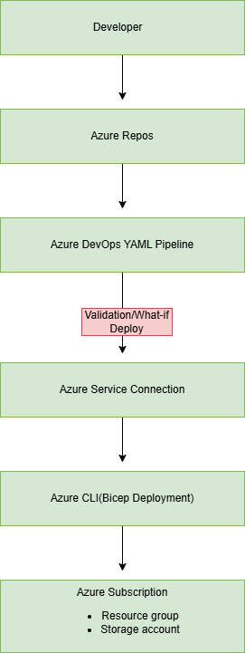
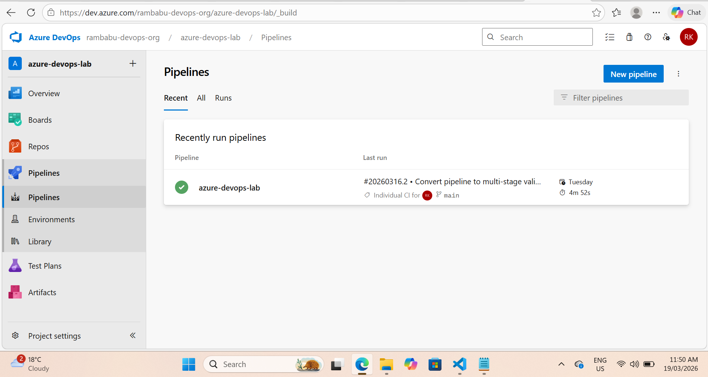
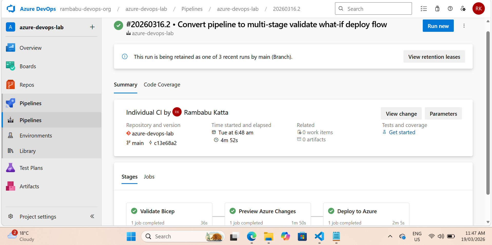
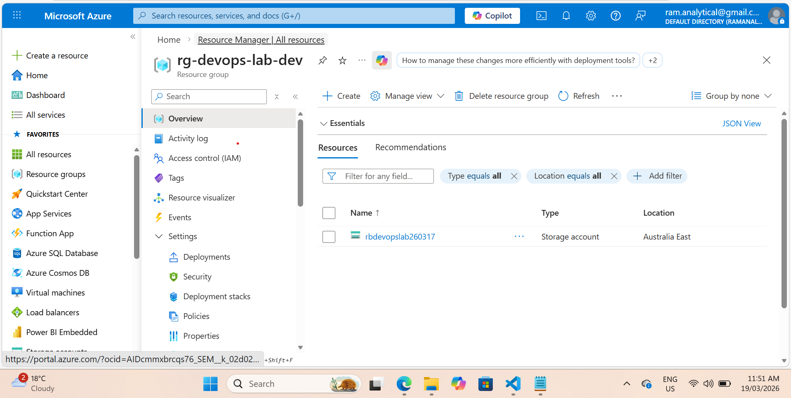

Azure DevOps CI/CD Pipeline with Bicep
📖 Overview

This project demonstrates an end-to-end Infrastructure as Code (IaC) deployment using Azure DevOps YAML pipelines and Bicep.

The solution automates validation and deployment of Azure resources using a CI/CD pipeline, ensuring consistency, repeatability, and reduced manual intervention.

This project was executed using Azure DevOps (Azure Repos) and mirrored to GitHub for visibility and documentation.

## 🧱 Architecture

🔍 Architecture Flow

Developer commits code to Azure Repos

Azure DevOps pipeline is triggered

Pipeline performs What-If validation

Deployment executed using Azure CLI + Bicep

Resources provisioned in Azure Resource Group

⚙️ Tech Stack
Category	Tools
CI/CD	Azure DevOps Pipelines
IaC	Bicep
Scripting	Azure CLI
Source Control	Azure Repos / GitHub
Cloud	Microsoft Azure
🔄 CI/CD Pipeline
Pipeline Workflow
Code Commit → Pipeline Trigger → What-If Validation → Deployment → Azure Resources
Pipeline Capabilities

YAML-based pipeline configuration

Infrastructure validation using What-If

Automated deployment using Azure CLI

Repeatable and consistent provisioning

The What-If operation previews infrastructure changes before deployment, helping reduce risk and improve confidence in deployments. ()

🔐 Authentication

The pipeline uses an Azure Service Connection to securely authenticate with the Azure subscription.

No credentials stored in code

Uses service principal with RBAC permissions

📦 Deployment Details
Resource Type	Description
Resource Group	Deployment scope
Storage Account	Provisioned via Bicep
📸 Evidence (Execution Proof)
✅ Pipeline Run (Successful Execution)

🔍 What-If Validation Output

☁️ Azure Resources (Post Deployment)

📁 Repository Structure
├── infra/
│   └── main.bicep
├── pipelines/
│   └── azure-pipelines.yml
├── docs/
│   ├── architecture-diagram.png
│   └── screenshots/
├── README.md
🧠 Key Learnings

Designed and implemented YAML-based CI/CD pipelines in Azure DevOps

Applied Infrastructure as Code using Bicep

Used What-If validation to preview infrastructure changes

Configured secure authentication using Service Connections

Understood complete CI/CD workflow for Azure deployments

🚀 Future Enhancements

Multi-stage pipeline (Dev / Test / Prod)

Approval gates before deployment

Parameterized deployments for multiple environments

Integration with Azure Monitor / Log Analytics

💼 Real-World Relevance

This project reflects a real-world DevOps scenario where infrastructure deployments are automated through CI/CD pipelines, improving reliability, reducing manual effort, and enabling safer releases.

👤 Author

Rambabu Katta
Azure Cloud / DevOps Engineer
Melbourne, Australia